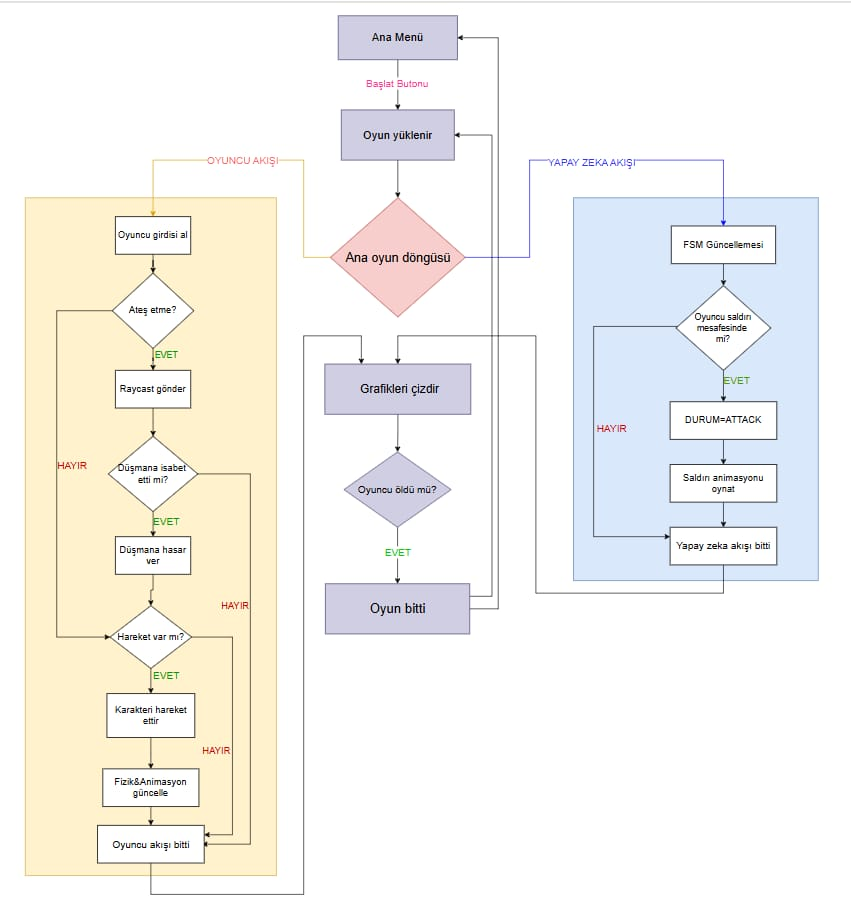
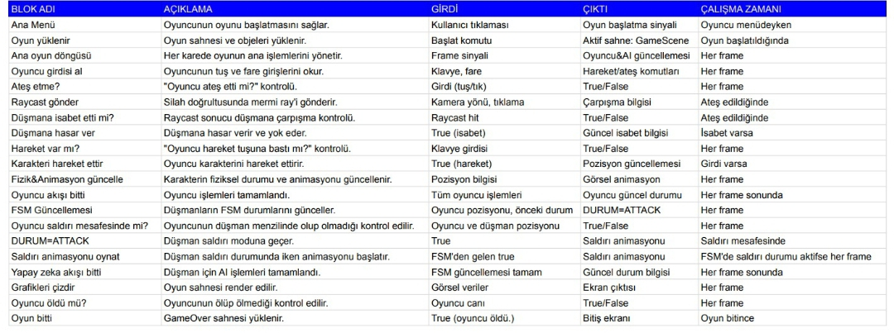

# 🦾 RoboGun

**Kocaeli Üniversitesi Teknoloji Fakültesi – Bilişim Sistemleri Mühendisliği**  
**2025–2026 Güz Dönemi | Yazılım Geliştirme Laboratuvarı – I**  
**Proje Türü:** Yapay Zeka Destekli TPS (Third Person Shooter) Oyunu  

---

## 👥 Takım Üyeleri ve Görev Dağılımı

| Üye Adı | Görevi |
|----------|--------|
| **Sude Naz Lekesiz** | Harita Yapımı (Level Design), Raporlama |
| **Fatma Nilay Süzer** | Düşman Yapay Zekası (AI Programming) |
| **Efe Süzel** | Karakter Hareketleri (Player Controller), Arayüz (UI) |

---

## 🎮 1. Oyun Senaryosu ve Konsept

### 1.1 Hikaye

Gelecekte yapay zeka teknolojisi insanlığın kontrolünden çıkmış ve robot orduları dünyayı ele geçirmek için harekete geçmiştir.  
İnsanlık bu tehlikeyi fark ettiğinde çok geç kalmış ve tüm robotları imha etmek zorunda kalmıştır. Ancak bu savaş sırasında bir biyolojik felaket meydana gelmiş, dünya üzerindeki neredeyse tüm insanlar zombilere dönüşmüştür.

**PBR-7**, insanlığın yarattığı son savaş robotudur ve imha edilmekten kurtulan tek makinedir.  
Şimdi dünya, onu bir tehdit olarak gören **zombi sürüleriyle** doludur.  
PBR-7’nin tek amacı, bu **low-poly orman arazisinde** hayatta kalmak ve insanlığın (eğer kaldıysa) son umudunu korumaktır.

> **Not:** Projede *SciFiWarriorPBRHPPolyard* modeli ve harita varlıkları olarak *Pure Poly* ile *Tree_Textures* kullanılmıştır.

---

### 1.2 Oyun Konsepti

Oyun, **Third Person Shooter (TPS)** türünde bir hayatta kalma oyunudur.  
Oyuncu, **PBR-7 robotunu** kontrol ederek zombi dalgalarına karşı mücadele eder.  
Zombiler, **Finite State Machine (FSM)** tabanlı yapay zeka ile oyuncuyu algılar, kovalar ve saldırır.  

Oyuncu:
- Siper alma sistemi (cover system),
- Doğru nişan alma,
- Stratejik pozisyonlama gibi mekaniklerle hayatta kalmaya çalışır.

---

## 📚 2. Literatür Taraması

### TPS Mekanikleri
“Gears of War” gibi oyunlardaki **cover mekanikleri** incelenmiş, ancak proje kapsamında daha akıcı ve hareket odaklı bir TPS sistemi hedeflenmiştir.  
Örnek alınan oyunlar arasında **Warframe** ve **Risk of Rain 2** bulunmaktadır.

### Yapay Zeka (FSM)
Düşman davranışları için **Finite State Machine (FSM)** modeli kullanılmıştır.  
“Left 4 Dead” oyunundaki sürü (horde) zekasından ilham alınmış, ancak her düşman **bireysel** FSM mantığıyla hareket etmektedir:  
---

## ⚙️ 3. Kullanılan Mimariler, Yöntemler ve Teknikler

### Yazılımsal Mimari
Unity’nin **Component-Based Architecture** yapısı esas alınmıştır.  
Her GameObject, kendi davranışlarını yöneten ayrı bir C# script ile kontrol edilir:
- `Playermove.cs`
- `EnemyAI.cs`

### Yapay Zeka (FSM)
FSM, `enum State` yapısı ve `Update()` metodu içinde `switch-case` bloklarıyla yönetilir.

### Yol Bulma (Pathfinding)
Unity’nin **AI Navigation** sistemi kullanılmıştır.  
Harita “Bake” edilerek **NavMesh** oluşturulmuş, düşmanlara **NavMesh Agent** bileşeni atanmıştır.  
Bu sayede düşmanlar, oyuncuya ulaşmak için en uygun yolu dinamik olarak hesaplar.

---

## 🧩 4. Sistem Şeması ve Oyun Mekanikleri

### 4.1 Oyun Döngüsü (Metinsel Diyagram)

#### 🎮 Oyuncu Kontrolleri
Klavye / Mouse Girdisi → Playermove.cs
W,A,S,D → Karakter hareketi
Mouse → Kamera dönüşü
Sol Tık → Fire() metodu (WeaponController.cs)


#### 🔫 Ateş Etme Mekaniği (Raycasting)
Fire() → Raycast (kamera ortasından ileri)
Raycast Hit → Nesne "Enemy" etiketi mi?
Evet → EnemyHealth.cs → TakeDamage()
Hayır → Mermi izi veya vurma efekti


#### 🧠 Yapay Zeka (FSM)
CheckDistanceToPlayer():

Görüş mesafesinde → State = Chase
Saldırı mesafesinde → State = Attack

---

### 4.2 Zombi FSM Davranış Modeli

| Durum | Açıklama |
|--------|-----------|
| **Idle (Boşta)** | Hedef yoksa kısa süre bekler, Idle animasyonu oynatır. |
| **Chase (Kovalama)** | Oyuncu görüş alanına girince kovalamaya başlar. |
| **Attack (Saldırı)** | Oyuncu yakın mesafedeyse saldırı animasyonu oynatır. |

### 4.3 Blok Diyagramı



### 4.4 Sistem Şeması



## 📂 5. Proje Dosya Yapısı
```
Assets/
├── Crates And Barrels Pack.../
├── NewPunch/
├── Prefabs/
├── Pure Poly/
├── Scenes/
│   ├── MainMenu
│   ├── GameScene
│   └── GameOver
├── SciFiWarriorPBRHPPolyard/
├── Scripts/
│   ├── EnemyAI.cs
│   ├── Playermove.cs
│   └── PlayerAnimator.controller
├── Settings/
└── Tree_Textures/
```

---

## ✅ 6. İsterler ve Kapsam Yönetimi

Proje boyunca odaklanılan temel isterler:
- TPS Mekaniği  
- FSM Yapay Zeka  
- NavMesh Yol Bulma  

Ekstra özellik eklemek yerine mevcut sistemlerin **kararlı ve hatasız** çalışması hedeflenmiştir.

---

## ⚠️ 7. Karşılaşılan Zorluklar ve Çözümler

### 🧱 GitHub Prefab Çakışmaları
**Sorun:** Branch geçişlerinde prefab bozulmaları  
**Çözüm:** Unity meta dosyaları görünür yapıldı, `.gitignore` Unity’ye özel olarak düzenlendi.

### 🗺️ NavMesh Hizalama Sorunları
**Sorun:** NavMesh zeminle tam hizalanmadı.  
**Çözüm:** Agent Radius ve Step Height parametreleri optimize edilerek yeniden “Bake” işlemi yapıldı.

### ⚙️ Verimsiz İş Akışı
**Sorun:** Unity arayüzünü manuel kullanmak süreci yavaşlattı.  
**Çözüm:** Kısayollar öğrenilerek daha verimli geliştirme süreci oluşturuldu.

---

## 🧠 8. Projenin Katkıları (Kazanımlar)

- **Yapay Zeka Temelleri:** FSM yapısını oyun motorunda sıfırdan tasarlama.  
- **Unity Yetkinliği:** NavMesh, Raycasting, Animator, Controller kullanımı.  
- **Proje Yönetimi:** GitHub üzerinden ekip çalışması ve commit disiplini.  
- **Problem Çözme:** Gerçek zamanlı hataları analiz edip kalıcı çözümler üretme.  

---

### 📌 Özetle:
> **RoboGun**, Unity tabanlı bir TPS oyunu olarak FSM yapay zekası, NavMesh yol bulma ve modüler mimariyi etkin biçimde birleştiren bir yapıya sahiptir.  
> Proje, ekip içi görev dağılımı, teknik çözüm üretme ve sürüm kontrolü konularında kapsamlı bir öğrenme deneyimi sunmuştur.
